

CURSO: MINERÍA DE DATOS

MAESTRÍA EN EXPLOTACIÓN DE DATOS Y DESCUBRIMIENTO DE
CONOCIMIENTO

# Música y Pandemia:  
¿Fueron diferentes el 2019 y el 2020?

TRABAJO PRÁCTICO ENTREGABLE I  
Preprocesamiento de datos y Bases de datos NoSQL

### Data Mining

Explotación de Datos y Descubrimiento de
Conocimiento

Grupo 6,
Integrantes: Guadalupe Alonso, Macarena
Roel, Clara Villalba

-----

### Resumen 

El objetivo de este trabajo es comparar las canciones
más escuchadas del año 2019 con las del año 2020, con el fin de
analizar si el contexto de la pandemia tuvo un impacto notable sobre el
consumo de música de las personas. Para ello, se trabajó con información
proveniente de la aplicación multiplataforma de reproducción de música
en streaming Spotify. Específicamente, se utilizó la cantidad de
reproducciones semanales de las 200 canciones más escuchadas, junto con
un conjunto de parámetros técnicos que caracterizan cada canción. A
pesar de que el 2020 tiene mayor cantidad de escuchas, la variabilidad
temporal presenta muchas similitudes con el 2019, en ambos se observa
mayor cantidad de reproducciones en las primeras y últimas semanas del
año. Por otro lado, se compararon  las canciones más populares de cada
año, utilizando el método de componentes principales sobre las
características de las mismas. El nivel de
energía explicó entre un 33 y un 43% de la variación entre los datos,
pero no se encontraron diferencias observables entre ambos años
considerados. Se concluye que los cambios
mundiales en el estilo de vida no se ven reflejados
en la música escuchada
en Spotify. 

### Introducción

En el año 2020, la Pandemia cambió el mundo y tuvo
impactos socioeconómicos variados. Durante el año, y con diferentes
niveles de prohibición y duración, gran parte de los países implementó
medidas de restricción de la circulación como estrategia para mitigar la
propagación de la enfermedad. Además se generalizaron en el mundo
medidas de distanciamiento social, que cambiaron drásticamente el estilo
de vida de la mayoría de la población.  

El presente trabajo práctico tiene como finalidad
aplicar los conceptos presentados en la materia Data Mining, utilizando
datos de la vida real, específicamente de Spotify. Así mismo entrar en
la dinámica del modelo  KDD, Knowledge Discovery in Databases, que fue
el marco de trabajo estudiado durante el cursado de la materia.

El objetivo del presente trabajo es
dar los primeros pasos en el análisis del
impacto potencial del contexto de la pandemia
sobre el consumo de música de las personas.
Concretamente, se busca
dar respuesta a la pregunta ¿fue el 2020 diferente al 2019?.
Para ello, se
compararán los años
respecto a la cantidad de reproducciones, la variabilidad temporal en la
cantidad de reproducciones, popularidad de ciertas canciones y el tipo
de las mismas. 

Se plantean entonces las siguientes preguntas cómo guía
en el desarrollo del trabajo: 1) ¿Hubo una diferencia en la cantidad de
reproducciones del año 2020? 2) ¿La variación interanual en la cantidad
de reproducciones presenta el mismo comportamiento en ambos años? 3) ¿El
tipo de música escuchado fue el mismo? 4) ¿Cuál fue el tipo de música
más popular en un año y en el otro?

Este trabajo está organizado en tres grandes secciones:
Análisis Exploratorio, Comparación 2019/2020 y  Conclusiones. En la
primera sección se presenta la base de datos de la plataforma Spotify,
el proceso de limpieza, selección, análisis exploratorio y
transformación  de los datos con los que se trabajarán. En Comparación
2019/2020 se muestra la metodología de comparación entre ambos años y el
análisis realizado para poder llegar a las respuestas de las preguntas
de investigación. En la  Figura 1  se puede observar de manera gráfica
este proceso. 

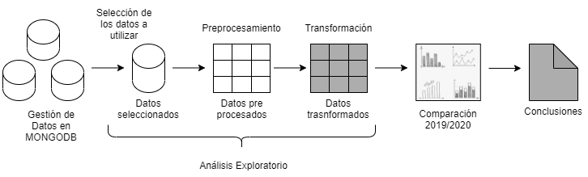

Figura 1: Esquema del proceso realizado en este
trabajo

### Análisis Exploratorio

#### Datos Utilizados:

La información proveniente de la plataforma fue
extraída y brindada por los docentes de la materia en tres archivos
JSON. Para la exploración de estos temas, se utilizará el IDE
RStudio del lenguaje de
programación R y la Base de Datos MongoDB.

Se generó utilizando Mongodb la base de datos
‘SPOTIFY\_DM’ con las colecciones ‘FEATURES’, ‘ARTIST’ y ‘CHARTS’. En
base a las preguntas que se plantearon, en el desarrollo de este trabajo
no se utilizó la información correspondiente a los artistas. Se
trabajará con las colecciones ‘CHARTS’ y ‘FEATURES’. 

A continuación se presenta el pasaje de dichas
colecciones a dataset para poder manipularlo, se  describen sus
principales características y tareas de pre procesamientos realizadas en
cada uno. Para cada
colección se presenta además un primer análisis exploratorio, con el fin
de conocer mejor el dominio antes de pasar a la selección de datos sobre
los que se trabajará. 

#### CHARTS:

En esta colección está la información correspondiente a
las 200 canciones más escuchadas por semana entre enero de 2018 y enero
de 2021. La información está en 63600 documentos con 8 campos cada uno.
Para la construcción del dataset a utilizar, se
tomaron las variables:
‘Position’, ‘Track\_Name’, ‘Artist’, ‘Streams’,’week\_start’ y
‘week\_end’. 

##### Preprocesamiento:

El primer paso fue seleccionar el intervalo temporal de
interés, para esto se filtran todas las semanas que no corresponden a
los años 2019 y 2020. Se seleccionaron entonces las observaciones entre
la semana del 04-01-2019 y la semana del 25-12-2020. Dado que la
información corresponde a los 200 temas más escuchados por semana y el
periodo de tiempo seleccionado es de 104 semanas, se espera que el
dataset tenga alrededor de 20800 observaciones. Sin embargo, el dataset
tiene unos 63600, con toda la información semanal duplicada \[32196
filas duplicadas\]. Además, se detectaron observaciones duplicadas en
cada semana del mes de mayo 2020, con la variable ‘Track Name’ vacía.
Una vez eliminada la información duplicada, se cuenta con 20800
observaciones. 

La cantidad de reproducciones (‘Streams’) tiene una
distribución sesgada a la derecha, que se presenta junto con sus
parámetros en el histograma a continuación (Figura 2).

 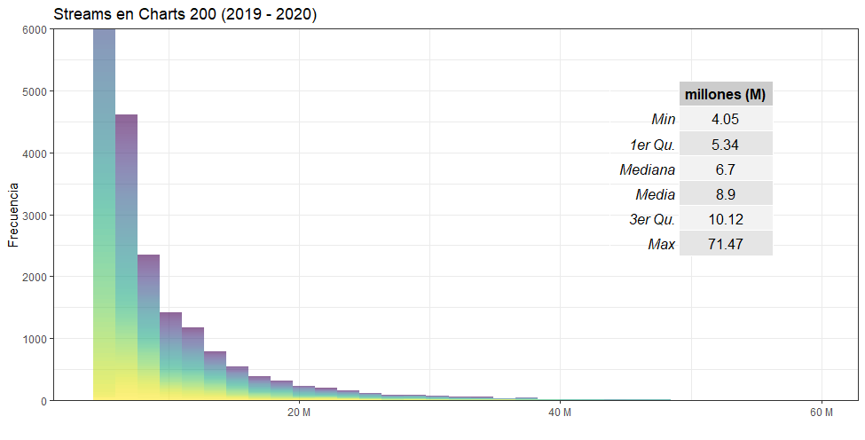

Figura
2: Histograma de
Streams para todas las canciones de los Charts 200 de los años 2019 -
2020. En la tabla se muestran parámetros de la distribución. Se utilizó
escala de colores según la semana.

Por otro lado, de las 20804 observaciones, 1908 tienen
valor único de Track\_Name y  547 de Artista. Considerando la
posibilidad de que exista una canción que coincida en nombre a pesar de
no ser la misma, se contabilizan valores cuya combinación de Track\_Name
y Artista son coincidentes y se obtienen 1933 canciones. 

Para analizar en más detalle la asimetría en la
distribución de cantidad de escuchas, se realizó un gráfico tipo boxplot
de la cantidad de Streams en función de la posición en el chart. En la
Figura 3 se ve un claro decaimiento exponencial en la cantidad media de
escuchas entre el Puesto 1 y el Puesto 200. Podríamos decir que el
primer puesto del chart es escuchado, en promedio, 10  millones de veces
más que el puesto 200.  En todos los casos se encuentran valores
apartados de la media en más de 1.5\*Rango Intercuartil, lo que indica
valores atípicos en prácticamente todas las posiciones de los charts
semanales.

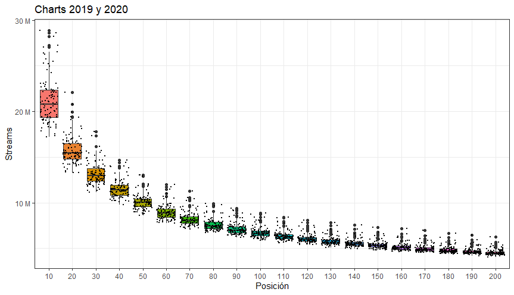

Figura
3: Boxplot de
cantidad de reproducciones semanales (Streams) de las canciones en las
200 canciones más escuchadas (Charts) para los años 2019 y 2020. Se
muestran las posiciones por cada diez a partir del puesto 10 para mejor
visualización. 

Es de particular interés para este trabajo analizar las
variaciones temporales de la cantidad de escuchas. En la Figura 4 se
muestra la variación temporal de la cantidad de reproducciones según el
puesto en Charts. Nuevamente puede verse la marcada diferencia en
cantidad de reproducciones entre los primeros puestos y el resto del
ranking, pero además puede verse que la variabilidad de los primeros
puestos es mayor. 

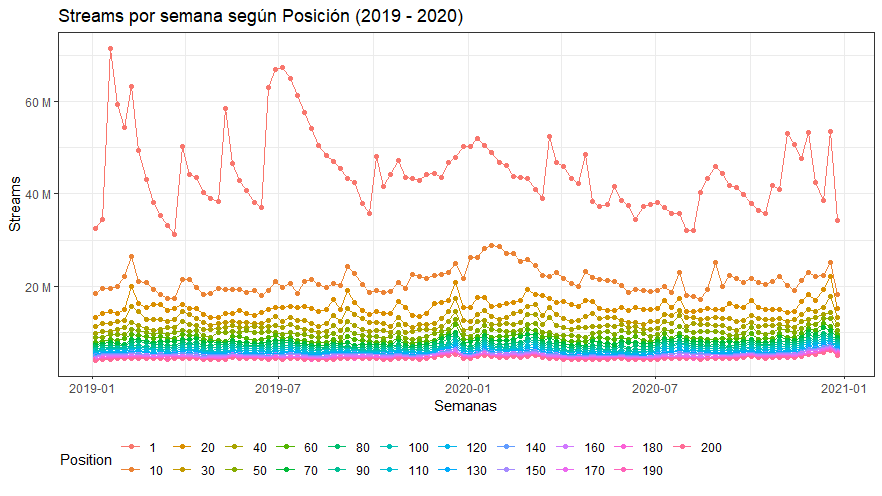

Figura 4: Evolución temporal de
cantidad de reproducciones para cada
posición en el periodo estudiado. Por claridad, se muestran algunas
posiciones.

#### FEATURES:

Según el enunciado del TP, en esta colección hay
información de las canciones que aparecen en los charts 200 en el
periodo analizado. Contiene 182049 documentos, con gran cantidad de
campos, entre los cuales algunos como ‘album\_images’ o
‘available\_markets’, no serán incluidas en el dataset final
‘Features’ pues  no son relevantes para el objetivo de este
trabajo.

##### Preprocesamiento:

De acuerdo con el objetivo de este trabajo, decidimos
mantener todos los campos relacionados a las métricas: 'acousticness',
'valence', 'danceability', 'energy', 'liveness', 'loudness',
'speechiness', además del ‘Track\_Name’ y  ‘artist\_name’. A
continuación se da una breve descripción de cada una según la
 referencia Web de la Api de Spotify.

  - Acousticness (Float):
    medida de confianza de si la pista es
    acústica. Toma valores de 0.0 a 1.0, donde
    1.0 representa una alta confianza en que la
    pista es acústica.
  - Valence (Float):
    medida del nivel de “positividad de la canción”. Toma valores de 0.0
    a 1.0. Las pistas con valencia alta suenan más positivas (por ej.
    feliz, alegre, eufórico), mientras que las pistas con valencia baja
    suenan más negativas (por ej. triste, deprimido, enojado).
  - Danceability (Float):
    describe qué tan adecuada es una pista para bailar en función de una
    combinación de elementos musicales que incluyen tempo, estabilidad
    del ritmo, fuerza del ritmo y regularidad general.
    Un valor de 0.0 es menos bailable y 1.0 es
    más bailable.
  - Energy (Float):
    representa una medida perceptiva de intensidad y actividad. Toma
    valores de 0.0 a 1.0 . Por lo general, las pistas enérgicas se
    sienten rápidas  y ruidosas.
  - Liveness
    (Float)
    : detecta la presencia de audiencia en la grabación, Un valor
    superior a 0,8 indica una gran probabilidad de que la pista haya
    sido grabada en vivo.
  - Loudness (Float):
    volumen general de una pista en decibeles. Los valores de sonoridad
    se promedian en toda la pista y son útiles para comparar la
    sonoridad relativa de las pistas. Los valores típicos oscilan entre
    -60 y 0 db.
  - Speechiness (Float):
    detecta la presencia de palabras habladas en una pista. Valores
    superiores a 0,66 describen pistas que probablemente estén
    compuestas en su totalidad por palabras habladas. Los valores entre
    0,33 y 0,66 describen pistas que pueden contener tanto música como
    voz, como la música rap. Los valores por debajo de 0,33
    probablemente representan música y otras pistas que no se parecen al
    habla.

De las 182049 observaciones que tiene originalmente el
dataset ‘Features’,  ‘Track\_id’ tiene 149539 y  ‘Track\_name’  74072.
Si consideramos la combinación de Track\_name con Artist\_Name, se
tienen 74098 valores. 

La cantidad de observaciones da a pensar que hay
información duplicada, hecho que se confirma explorando algunas de las
variables. Por ejemplo la canción “Despacito”
aparece 1304 veces en la colección, con 580 álbumes diferentes. En la
TABLA 1 se puede observar por ejemplo como en 5 álbumes distintos varían
estas métricas.

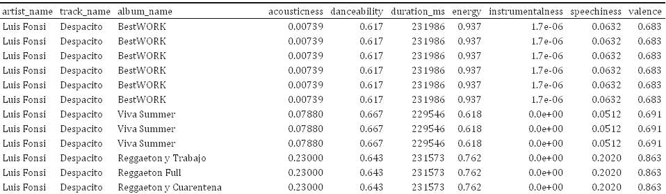

Tabla 1:  Ejemplo de variación de métricas en el
tema Despacito

Por lo detallado anteriormente decidimos transformar
los datos tomando la mediana de las variables numéricas a analizar, pues
al ser una medida robusta  nos permite lidiar con esta variabilidad y
quedarnos con un solo
registro por artista y track que resuma la información por tema.
 De aquí en adelante, es este dataset con 84920
observaciones al que se llamará ‘Features’ y se utilizará en la
integración con Charts.

### Integración de Charts con Features

De acuerdo con el objetivo del trabajo decidimos
focalizarnos en aquellas canciones que formaron parte de los TOP 200 en
los años 2019 y 2020. Es por ello que se procede a la integración del
dataset Features con el dataset Charts.

Para caracterizar el tipo de canción que se escuchó en
cada año, es necesario tomar parámetros que aparecen en ‘Features’ que
corresponden con ‘Charts’. Es decir, determinar si existe un atributo o
clave que tenga una relación unívoca con las canciones que aparecen en
una y otra para poder joinear los dataset. El primer candidato intuitivo
es ‘\_ID’, sin embargo al usarlo como condición de join no obtuvimos
resultados. Luego de realizar varias pruebas finalmente  se decidió unir
ambas colecciones a partir de la coincidencia en los campos
‘track\_name’ y  “artist\_name”.

Igualmente al realizar este join observamos que hay
temas de Charts que no aparecen en Features. Vimos que de 20800 entradas
en Charts, solamente 18257 tienen coincidencia en Feature.
Es decir, hay unas 306 canciones en el periodo
estudiado para las que no se cuenta con información sobre sus
características. Se toma la decisión de
considerar estos como datos faltantes, aunque
podría mejorarse esta integración considerando alguna búsqueda más
refinada de caracteres. 

### Comparación 2019/2020

El objetivo del trabajo es ver si las condiciones
extraordinarias del año 2020 producidas por la Pandemia tuvieron un
impacto en el consumo de música de Spotify. ¿Cómo podría cuantificarse
esto? Una primera medida sería la cantidad de reproducciones, que fue de
alrededor de 90 mil millones en el 2019 y 95 mil millones en el 2020.

La cantidad de reproducciones varía en el tiempo y como
primera comparación se grafican las series temporales de acumulado de
escuchas semanales para los años 2019 y 2020. En principio puede verse
que la cantidad de reproducciones es mayor para casi todas las semanas
del año 2020 que para el año 2019, con algunas excepciones que podrían
ser producto de lo ruidoso de la serie. En la Figura
5, se muestra el
acumulado mensual de reproducciones. 

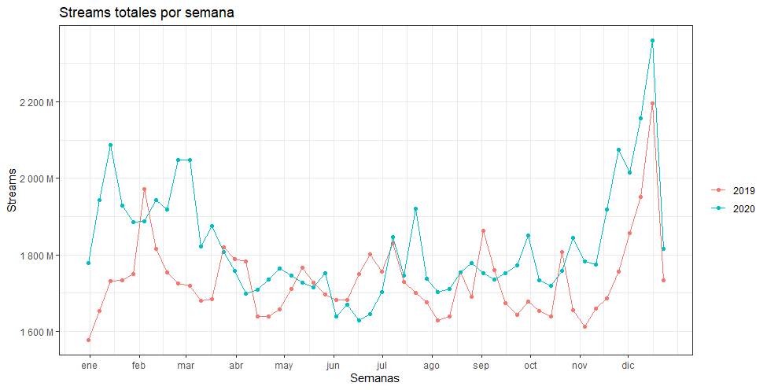

Figura
5: Streams
totales para las canciones en el top 200 de cada semana del año, en azul
el 2020 y en rojo el 2019. 

En la Figura
5 puede observarse que
la cantidad de reproducciones a lo largo de ambos años sigue un patrón
similar. Ambos años presentan una mayor cantidad de reproducciones en
sus extremos, es decir, al principio y al final de año, siendo esta
última la época con mayor escuchas semanales , mientras que se ve una
notoria caída en la cantidad de reproducciones en la mitad del
año.

En cuanto a la diferencia entre ambos años, a pesar de
esperarse una gran diferencia entre los mismos debido a lo anómalo del
año 2020, la misma no fue observada. Incluso se encontraron semanas en
las que la cantidad de reproducciones en el 2019 fue mayor a la del
2020. Sí puede notarse un aumento considerable de la diferencia entre el
número de reproducciones alrededor del principio de Marzo, mes en el
cual muchos países comenzaron sus cuarentenas estrictas.

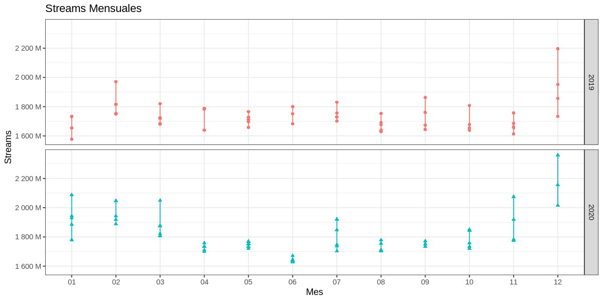

Figura
6: Progresión
mensual de las reproducciones para cada año

Al realizar el análisis de reproducciones de manera
mensual, como visto en la Figura 6, nuevamente se ve una similitud en la
distribución de las reproducciones entre ambos años. Esta vez, es más
notoria la baja de reproducciones en el año 2020 en los meses de Abril,
Mayo y Junio, que pueden pensarse tanto como una
coincidencia fortuita como como un reflejo de la mentalidad social en
esa época, tanto en lo relacionado con la extensión de los
confinamientos por la pandemia como el surgimiento de movimientos
sociales globales como Black Lives Matter, re-surgido en Estados Unidos
a principios de Junio.

Ahora bien, hasta aquí se analizaron solamente la
cantidad de reproducciones, lo
que no es necesariamente
la única medida de la manera en la que se
escuchó música durante determinado año.
Consideramos separar la
manera en la que se escuchó música en dos aspectos: cómo fue la
popularidad de las canciones en el año y cuál es el tipo de canción más
escuchada.

Para analizar cómo fue la popularidad de las canciones
en el año, se definió la variable
persistencia, que
cuenta la cantidad de semanas del año en el que cierta canción se
mantuvo en los
charts. En la
Figura 7 se muestran todas las canciones con persistencia (se descartan
aquellas que aparecen una única vez en charts), junto con la mejor y
peor posición alcanzadas durante su permanencia en charts. Puede verse
que la gran mayoría de canciones con alta persistencia estuvieron en
casi todas las posiciones dentro de los charts (esquina inferior derecha
de la Figura 7). Por otro lado, hay canciones de cierta persistencia que
nunca superan la posición 150 (esquina superior derecha de la Figura 7).
Finalmente, hay canciones persistentes que son las que podrían
considerarse populares: canciones que mientras se mantienen en charts
son muy reproducidas, manteniéndose en posiciones altas.  

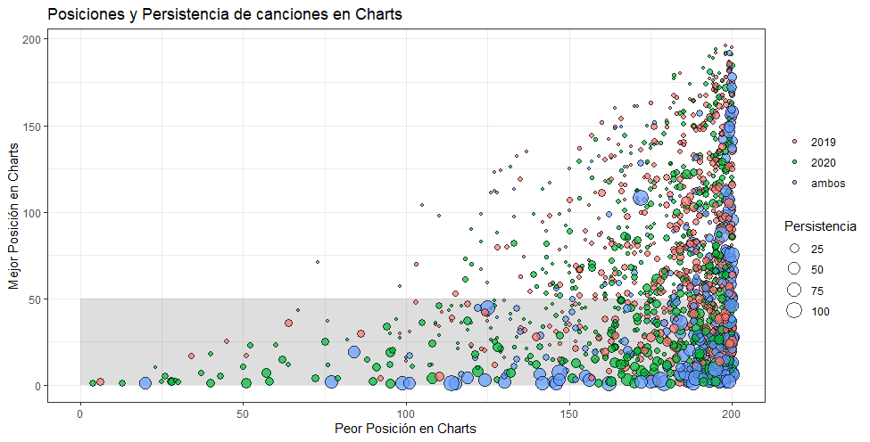

Figura 7: Gráfico de burbujas para canciones con
más de una aparición en charts. En el eje horizontal se presenta la
posición más baja en la que estuvieron y el eje vertical la posición más
alta. El tamaño es proporcional a la persistencia (cantidad de semanas
en charts). Los colores indican si pertenece al año 2019, al año 2020 o
a ambos. En gris se marca el conjunto de canciones que alcanzaron el Top
50.

Para comenzar con el análisis de la popularidad
relacionada con el tipo de música, se decidió estudiar la diferencia en
cada variable entre las canciones que se encontraron en el top 50 en
algún momento del año 2019, 2020 o en ambos años.

En la Figura 8 puede apreciarse que la distribución de
las variables de Features fue similar en los tres grupos. No pueden
verse grupos particulares de canciones ni sacar conclusiones acerca de
las mismas considerando sus características, pero sí nuevamente se ve la
asociación entre las variables, como la alta correlación entre las
variables “loudness” y “energy”.

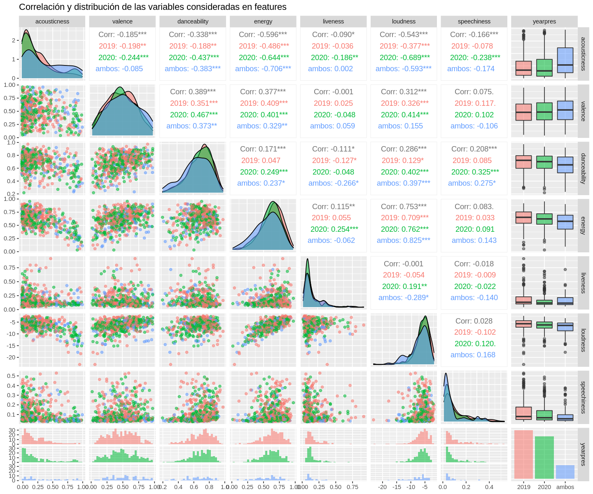

Figura 8: Histogramas, gráficos de correlación y
dispersión de las variables de Features consideradas, coloreadas según
su presencia en el top 50 en el año 2019, 2020 y en ambos años

Al haber tantas variables correlacionadas y que
explican información similar de acuerdo a sus mismas descripciones, se
consideró realizar una reducción de features. Para ello, se realizó un
Análisis de Componentes Principales (PCA).

El mismo se realizó utilizando los datos de las
canciones que se encontraron en el top 50 en cualquiera de los dos años
(n = 537), así como en ambos años por separado (n 2019 = 248  y n 2020 =
218) y en las que permanecieron en algún lugar del ranking en los dos
años (n = 71). Las variables consideradas para el PCA fueron
"acousticness", "valence", "danceability", "energy", "liveness",
"loudness" y "speechiness".  

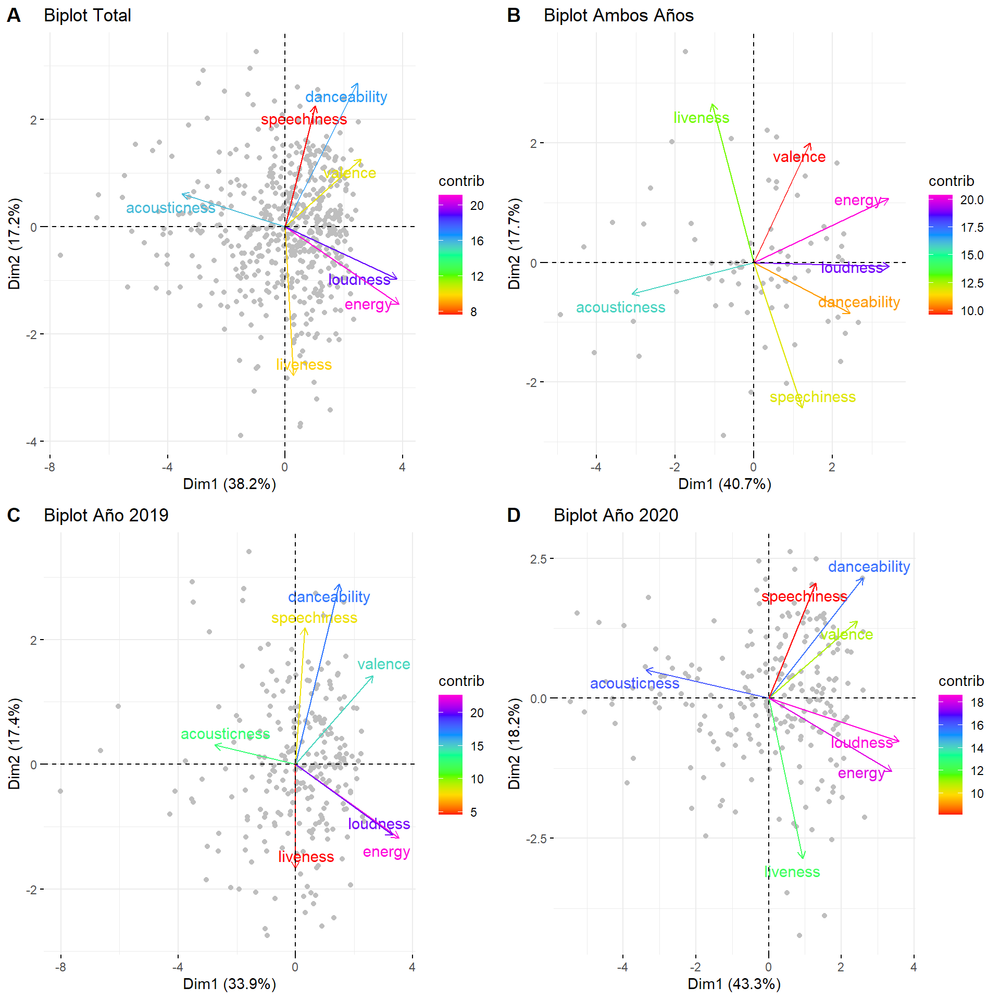

Figura 9: Biplots PCA. A: Datos totales. B: En los
charts ambos años, C: En los charts sólo en el año 2019. D: En los
charts solo en el año 2020. Las variables se encuentran coloreadas por
su contribución al primer componente principal

En el análisis de componentes principales, podemos
observar que la relación entre las variables permanece más o menos
constante entre los años 2019, 2020 y el total, cambiando ligeramente el
orden de la contribución de cada variable al componente. Sin embargo, en
el análisis de aquellas canciones que fueron populares ambos años pudo
verse una relación diferente entre las variables, muchas veces
invirtiéndose la
relación entre las mismas. Aún así, puede observarse gráficamente la
gran correlación previamente mencionada entre “loudness” y “energy”, y
podría decirse que el primer componente principal se define como aquel
que separa a las canciones en si son acústicas o si tienen un alto nivel
energético.

Refiriéndose a dicho componente principal, el
porcentaje de variación de los datos explicado por el mismo varía
ampliamente. Tomando en particular a los años 2019 y 2020, el primer
componente principal del 2019 explica un 33.9% de la variabilidad, con
un porcentaje de variabilidad acumulada explicada por los dos primeros
componentes del 51.3%, mientras que en el 2020 se vio que la
variabilidad explicada por el primer componente principal fue mucho
mayor, del 43.3%, mientras que la acumulada aumentó al 61.5%, un aumento
de más del 10% con respecto al análisis anterior. Esto nos haría
considerar que el eje acústico-energético es de mayor importancia al
separar a las canciones populares del 2020.

Para ahondar más sobre el tema de la persistencia de
las canciones en el ranking y a su vez ver su posible asociación con el
valor de cada canción según el primer componente principal, se graficó
la posición de cada canción en el ranking en cada uno de los años, y se
coloreó a cada una según su valor según el primer componente principal
(utilizando los valores obtenidos al estudiar el total de los
datos).

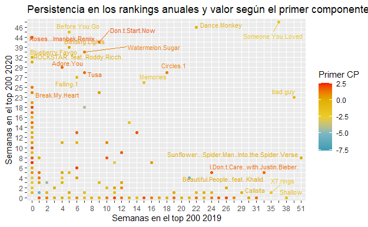

Figura 10: Persistencia de las canciones que
estuvieron en el top 50 en alguno de los años, coloreadas según su valor
según su primer componente principal. También se incluyó el nombre de
dicha canción en aquellas canciones que se encontraron más de 25 semanas
en el ranking de cualquiera de los dos años.

En la Figura 10 puede observarse que no hay una
relación clara entre el valor del primer componente principal y la
persistencia de las canciones en los charts,aunque sí puede mencionarse
que las canciones más populares tendieron a encontrarse más cerca del
lado energy/loudness de la escala que del lado acústico. 

### Conclusiones

Spotify es una
[aplicación](https://www.google.com/url?q=https://es.wikipedia.org/wiki/Aplicaci%25C3%25B3n_inform%25C3%25A1tica&sa=D&source=editors&ust=1632105579946000&usg=AOvVaw0XNjg5EIHShFrl542W5Y7K) multiplataforma
[sueca](https://www.google.com/url?q=https://es.wikipedia.org/wiki/Suecia&sa=D&source=editors&ust=1632105579946000&usg=AOvVaw1t-3wZRl-nh_9tTrZKWQpN),
empleada para la reproducción de música vía
[streaming](https://www.google.com/url?q=https://es.wikipedia.org/wiki/Streaming&sa=D&source=editors&ust=1632105579946000&usg=AOvVaw3sdbXe_vgP0bgfWV09DRFO).
El presente trabajo se da en contexto de pandemia global y
distanciamiento social
provocados por el COVID-19. Los datos de Spotify con que contamos
corresponden al periodo inmediatamente anterior y durante dicha pandemia
(2018 a 2020) por lo tanto nos resulta de interés enfocar nuestro
análisis en encontrar algún patrón relacionado a ese contexto.

Sobre el principio del trabajo se plantearon una serie
de preguntas a manera de guía, a continuación se presentan las
respuestas de las mismas a las que se llegó luego del proceso de
selección de datos, limpieza, transformación y análisis exploratorio.

¿Hubo una diferencia en la cantidad de
reproducciones del año 2020? Si, en el año 2020
la cantidad de reproducciones totales del año supera en 5 mil millones a
las del año 2019. 

¿La variación interanual en la cantidad de
reproducciones presenta el mismo comportamiento en ambos
años? Como se dijo,
en el año 2020 la cantidad de streams fue mayor. Sin embargo, si se
analiza la serie semanal (Figura 5), puede verse que entre los meses de
abril y julio la cantidad total de escuchas semanales es muy similar
entre ambos años (o inclusive en alguna semana es mayor en el año 2019).
Ambos años tienen un comportamiento similar de máximos de escuchas
totales en los primeros y últimos meses del año, alcanzando el máximo en
diciembre. Pero el decaimiento en cantidad de escuchas semanales es más
abrupto entre marzo y julio para el año 2020 (Figura 6).

¿El tipo de música escuchado fue el
mismo? Ninguno de los
parámetros característicos de las canciones que estuvieron en charts en
los años 2019, 2020 y en ambos, presentan un patrón claro de
diferenciación (Figura 7). Además, algunos parámetros presentan alta
correlación lineal. Como estrategia para poder reducir la
dimensionalidad en la caracterización de las canciones, se implementó el
análisis de componentes principales. Se tomaron las canciones con
mejores posiciones en el ranking, para enfocarse en las más populares.
Las primeras componentes no presentan grandes diferencias entre años,
pero sí la cantidad de varianza explicada. En el año 2020 la primera
componente explica un 10% más de varianza que en el 2019, lo que podría
indicar una mayor popularidad de canciones del tipo caracterizado por
esa componente.  

¿Cuál fue el tipo de música más popular en un año y
en el otro? En ambos
años, las canciones con un perfil más bien energético fueron las que
dominaron los charts y permanecieron más tiempo en los mismos. Sin
embargo, como fue mencionado anteriormente, no se observaron grandes
diferencias entre los tipos de música populares de los dos años.

La conclusión general es entonces que no se encontraron
diferencias notables entre los años 2019 y 2020. 

